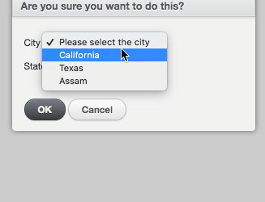
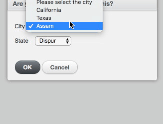
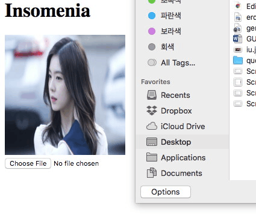

# 개발자 헬퍼

* <a href="#active_admin_user_list">액티브어드민 리스트 원하는 개수 정렬</a>
* <a href="#active_admin_select_download">액티브어드민 선택한 항목만 CSV 다운로드 하기</a>
* <a href="#js_city_state">액티브어드민 배치액션 폼에서 city-state js로 구현하기</a>
* <a href="#image_direct_upload">이미지 즉각 업로드</a>
* <a href="#imageviewer">js로 이미지 뷰어 (확대 가능)</a>
* <a href="#ransack">액티브 어드민에서 ransack 으로 필터 자유자재로 구현하기</a>
* <a href="#tinymce">액티브 어드민에서 tinymce (wysiwyg editor) 이미지 업로드 까지 구현하기</a>

---
<h2>위의 사항은 플젝에 전부 구현해 놓은 상태이니 클론해서 보셔도 됩니다</h2>

---

<h2 id="active_admin_user_list">액티브어드민 리스트 원하는 개수 정렬</h2>

어드민 페이지에서 특정 모델 가령 유저리스트를 10명씩 보기 30명씩 보기 모두 보기 등등을 구현하는 방법입니다.

액티브 어드민에서는 주소로 이를 처리하는데요 해당 주소는
~~~
/admin/users?order=id_desc&per_page=10"
~~~
형태로 날아가게 됩니다. 그래서 실질적으로 url의 모델명과 숫자부분만 편집해서 링크를 만들어주면 간단하게 해결할 수 있습니다.

실제 프로젝트에 이용하실 때는 아래와같이 코드를 사용하시면 됩니다.
~~~c
index do
    selectable_column
    id_column
    br
    a link_to ("10 명씩 보기"), "/admin/users?order=id_desc&per_page=10"
    a link_to ("30 명씩 보기"), "/admin/users?order=id_desc&per_page=30"
    a link_to ("50 명씩 보기"), "/admin/users?order=id_desc&per_page=50"
    a link_to ("모두 보기"), "/admin/users?order=id_desc&per_page=#{User.all.size}"
    actions
  end
~~~
이렇게 해주시고 클래스를 넣어 스타일까지 입히면 완벽합니다.

active_admin.rb 에서도 이를 해결 할 수 있는데요
~~~c
config.default_per_page = 30
~~~
~~~c
config.per_page = 10
~~~
~~~c
config.per_page = [10, 50, 100]
~~~
위처럼 처리 할 수도 있고
~~~c
controller do
  before_action only: :index do
    @per_page = 100
  end
end
~~~
이런식으로 컨트롤러에서도 처리해줄 수 있습니다.

하지만 기존 액티브어드민에서 제공하는 것보다 직접만드는게 더 보기 좋기 때문에 직접 만드시는 것을 추천합니다.

---

<h2 id="active_admin_select_download">액티브어드민 선택한 항목만 CSV 다운로드 하기</h2>

액티브 어드민에서 특정 모델의 특정 리스트 만을 액셀 형태로 다운받고싶다면 간단하게 구현 할 수 있습니다.

액티브 어드민에서는 이를 주소로 처리하는데요

~~~c
  batch_action "download" do |ids|
    redirect_to "/admin/users.csv?q[id_in][]=" + ids.join("&q[id_in][]=")
  end
~~~
이렇게 배치액션하나만 만들어 주면 됩니다. /admin/모델명s.... 이런식으로 만들어주시면 됩니다.

---

<h2 id="js_city_state">액티브어드민 배치액션 폼에서 city-state js로 구현하기</h2>

액티브 어드민의 배치액션의 폼같이 직접 내부 요소들은 컨트롤하기 어려운 경우 이를 전부 js로 구현해야 합니다.

배치액션 폼 부분의 코드입니다.
~~~c
batch_action "city state", form: {
    city: City.all.pluck(:city_name, :id).insert(0, ["Please select the city",0]),
    state: ["----"]
  }
~~~
이렇게 city 리스트만 폼에 띄워주고, state는 비워두고 js쪽에서 처리하게 합시다.

먼저 사용 할 리스트들은 직접 js 배열에 담아줍니다.
~~~c
var city1 = [
    {display: "state1", value: "0" },
    {display: "state2", value: "1" },
    {display: "state3", value: "2" }];

var city2 = [
    {display: "state4", value: "3" },
    {display: "state5", value: "4" },
    {display: "state6", value: "5" }];

var city3 = [
    {display: "state7", value: "6" },
    {display: "state8", value: "7" },
    {display: "state9", value: "8" }];
~~~

그다음은 위에서 만들어둔 특정 city의 배열이 들어왔을 때 그에 속한 state들을 지우고 다시 append 해주는 함수를 만들어 줍니다
~~~c
function call_state_by_city(city_ary){
  $('[name="state"]').empty();
  $('[name="state"]').append("<option>--Select--</option>");
  $(city_ary).each(function(i){
    $('[name="state"]').append("<option value=\""+city_ary[i].value+"\">"+city_ary[i].display+"</option>")
  });
}
~~~

이제는 city를 셀렉트 할 때마다 해당 city에 속한 state들이 append 되게 해주면 됩니다.
~~~c
$(document).ready(function () {
// 액티브어드민의 모든요소가 로드 된 후 js를 실행하기 위해 document ready함수 안에 넣어줍니다.

  $('.batch_action[data-action=city]').on("click", function(){
  // 배치액션을 눌러야 내부 요소들을 그릴 수 있기 때문에 배치액션을 누르는 함수로 감싸줍니다.

    $('[name="city"]').on("change", function(){
      var select = $('[name="city"] option:selected').val();
      switch(select){
        case "city1":
          call_state_by_city(city1);
        break;

        case "city2":
          call_state_by_city(city2);
        break;

        case "city3":
          call_state_by_city(city3);
        break;

        default:
        //기본 셋팅도 해줍니다.
          $('[name="city"]').empty();
          $('[name="city"]').append("<option>--Select--</option>");
        break;
      }
    });
  });
});
~~~
이렇게 js로 내부요소를 컨트롤하기 어려울 때 city state를 구현 할 수 있습니다.

그리고 특정 모델의 has_many 인 모델들을 불러오고 싶을 때의 경우도 생각해 볼 수 있습니다.

즉 City 가 has_many :states 이고 State가 belongs_to :city 일 경우 city state를 구현하는 방법입니다.

먼저 특정 city가 인자로 들어왔을 때 그에 속하는 state 를 json 타입으로 넘겨 줄 주소를 만들어 줍니다
~~~c
get "/get_states_by_city/:city_id" => "citys#get_states_by_city"
~~~

그리고 citys 컨트롤러의 get_states_by_city 액션 코드를 아래처럼 만들어 json 타입으로 states 를 던져줄 수 있도록 합니다.
~~~c
  def get_states_by_city
    if City.find(params[:city_id]).present?
      city = City.find(params[:city_id])
      @states = city.states
    end

    render json: {states: @states}
  end
~~~

다음은 이 주소를 이용해서 city id를 넘겨주고 json 타입으로 states를 받아와서 append 해주는 함수를 만듭니다.
~~~c
  function city_state(city_id){
    $.get("/get_states_by_city/" + city_id, function(data){
      var state = $('[name="state"]');
      state.empty();
      for (var i = 0; i < data.states.length; i++) {
        state.append('<option value=' + data.states[i].id + '>' + data.states[i].state_name + '</option>');
      }
    }, "json");
  }
~~~

마지막으로 특정 city를 셀렉트 했을 때 바뀌게 되는 함수를 만들어줍니다.
~~~c
$('[name="city"]').change(function () {
  var val = $(this).val();
  city_state(val);
});
~~~

이렇게 경우에 따라 js로 city state를 완벽하게 구현 할 수 있습니다.

---

<h2 id="image_direct_upload">이미지 즉각 업로드</h2>

이미지를업로드 할 때 사진을 올렸으면, 즉각적으로 이미지가 바뀌게 하는 js 코드입니다.

먼저 파일을 읽는 함수를 만들어 줍시다. 이름은 readURL 로 하겠습니다.
~~~c
  function readURL(input) {
         if (input.files && input.files[0]) {
             var reader = new FileReader();

             reader.onload = function (e) {
                 $('img').attr('src', e.target.result);
             };

             reader.readAsDataURL(input.files[0]);
         }
     }
~~~
파일이 한 개 또는 여러개 들어왔을 때 첫번 째 이미지를 js에서 제공하는 FileReader함수로 읽게 해주고 그 결과를 바로 이미지에 띄워주는 역할의 함수입니다.

~~~c
  $('input').on('change', function(){
    readURL(this);
  });
~~~
이후 change 함수로 this를 인수로 넘겨줍니다. 그럼 파일을 업로드 할 때마다 즉각적으로 이미지가 바뀌게 됩니다.

---

<h2 id="imageviewer">js로 이미지 뷰어 구현하기 (확대가능)</h2>

이미지 뷰어를 구현하고, 확대기능 까지 만드는 일은 사실상 매우 어려운 작업입니다.

js 오픈소스를 이용해서 이를 매우 간단하고 빠르게 해결 할 수 있습니다.

먼저 코드 복붙은 해주셔야합니다. imageviewer.js 와 imageviewer.scss 파일을 생성해주고 아래의 코드들을 각각 복붙해줍니다.
https://github.com/godwon2095/insomenia_developer_helper/blob/master/app/assets/javascripts/imageviewer.js
https://github.com/godwon2095/insomenia_developer_helper/blob/master/app/assets/stylesheets/imageviewer.scss

코드를 붙여 넣었다면 require 과 import를 해줍니다.

~~~c
//= require imageviewer
~~~
~~~c
@import 'imageviewer';
~~~

여기까지 완료했다면 아래의 js 코드만 이용하면 바로 이미지 뷰어를 사용하실 수 있습니다!

~~~c
$(function () {
    var viewer = ImageViewer();
    $('img').click(function () {
        var imgSrc = this.src 
        viewer.show(imgSrc);
    });
});
~~~

---

<h2 id="ransack">액티브 어드민에서 ransack 으로 필터기능 자유자재로 구현하기 </h2>

액티브 어드민에서는 필터는 ransack 을 이용해서 구현했는데요. 그래서 ransack에 대한 이해가 있다면,  

액티브 어드민에서 쉽게 복잡한 필터기능을 구현할 수 있습니다.  

먼저 ransack 에 대한 설명입니다. https://github.com/activerecord-hackery/ransack  

정리가 잘 되어있지만 간단하게 ransack을 어떻게 사용하는지 적어보겠습니다.  

예를 들어 User 모델이 has_many :supports 이고, Support 모델에 state (integer) 컬럼이 있다고 합시다.  

ransack을 사용하실 때에는 항상 rails console 에서 결과를 보고 사용하시는 것이 좋습니다.  

> User.ransack(supports_state_eq: 0).result  

이런식으로 명령어를 사용하게 되면, User model 에서 supports 의 state가 0인 User 객체들을 뽑아올 수 있게 됩니다.  

(주의 : 아무것도 안나와야 하는 경우도 직접 돌려보고 결과가 나온다면 문법이 잘못 된 것이니 꼭!! 틀린 경우도 첵킹해주세요)

여기서 eq 는 보통 integer 타입에서 사용하게 되는데요, 일치함을 첵킹하게 됩니다.   

이 와 비슷하게 cont 는 보통 string 타입에서 유사성을 검사합니다.  

그래서 실제 액티브 어드민에서 핅터를 구현 할 때는 아래와 같이 사용하시면 됩니다.  

~~~c
filter :supports_state_eq, label: '지원 상태', as: :select, collection: state_collection  
~~~

이렇게 하면 복잡한 구조로 설계되어 있어도 간단하게 필터기능을 구현 할 수 있습니다.  

---

<h2 id="tinymce">액티브 어드민에서 tinymce 이미지 업로드 까지 구현하기</h2>

어드민에서 wysiwyg editor 를 삽입하는 것은 간단하게 구현할 수 있습니다.

먼저 젬을 설치해 줍니다

~~~c
gem 'tinymce-rails'
gem 'tinymce-rails-imageupload', '~> 4.0.0.beta'
~~~

bundle 도 진행 해줍니다

~~~c
bundle install
~~~

이후에 active_admin.js 에 아래와 같이 코드를 추가해줍니다.

~~~c
//= require tinymce

TinyMCERails.configuration.default = {
  selector: "textarea.tinymce",
  toolbar: ["styleselect | bold italic | undo redo","link | uploadimage"],
  plugins: "link,uploadimage"
};
TinyMCERails.initialize('default', {
});
~~~

이후에 어드민쪽 페이지에 아래처럼 코드를 추가해줍니다.

~~~c
f.input :content, input_html: {class: "tinymce"}
~~~

이렇게 하면 tinymce 에디터를 띄우는 것에 성공하실 수 있을 겁니다. 

하지만 이 상태에서는 이미지 업로드 기능이 정상적으로 작동하지 않을 겁니다.

일단 해당 처리를 해줄 컨트롤러를 만들어줍니다.

>rails g controller tinymce_assets

이후에 컨트롤러에서 create액션을 사용할 주소를 만들어줍니다.

~~~c
post '/tinymce_assets' => 'tinymce_assets#create'
~~~

이후에는 tinymce_assets controller 에서
~~~c
class TinymceAssetsController < ApplicationController
  def create
    file = params[:file]
    uploader = UserImageUploader.new #업로더라는 이름으로 좀업로더 객체 생성

    uploader.store!(file)
    render json: {
      image: {
        url: uploader.url
      }
    }, content_type: "text/html"
  end
end
~~~
이렇게 하면 이미지를 json 타입으로 에디터에 보내주고 처리해서 바로 띄울 수 있어야 하는데 한가지 오류가 뜰 것 입니다.

model 의 id가 없다는 오류일텐데요 이부분은 uploader 파일에 들어가서 기존의
~~~c
def store_dir
"uploads/#{model.class.to_s.underscore}/#{mounted_as}/#{model.id}"
end
~~~
부분의 model.id 부분을 지워주면 됩니다.
~~~c
def store_dir
"uploads/#{model.class.to_s.underscore}/#{mounted_as}"
end
~~~

이렇게 하시면 완벽하게 액티브어드민에 tinymce editor를 삽입 할 수 있습니다.
